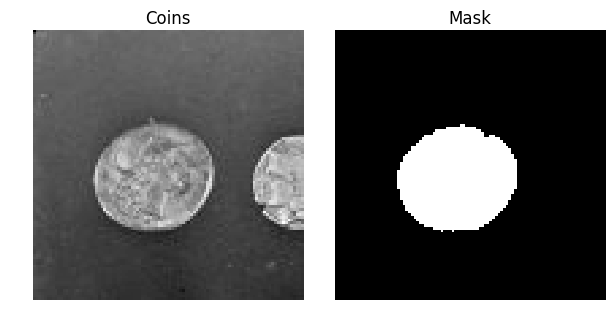

# SingleCellDetect

> Detect a single cell located in the center of a 2d image

This package provided a method `watershed_edge` for detecting the boundaries of a single cell located at the center of an image and is useful when performing cell finding on biological images or movie. It may be used together with other packages that finds the locations of cell centers in a larger image.

### install

```bash
git clone https://github.com/sofroniewn/SingleCellDetect
```

### example
```python
import matplotlib.pyplot as plt
from single_cell_detect import watershed_edge as detect
from skimage.data import coins

image = coins()[:100,:100]
mask = detect(image, dilationSize=1, radial=True, filterSize=5)

fig, axes = plt.subplots(ncols=2, figsize=(6, 3), sharex=True, sharey=True, subplot_kw={'adjustable':'box-forced'})
ax0, ax1 = axes

ax0.imshow(image, cmap=plt.cm.gray, interpolation='nearest')
ax0.set_title('Coins')
ax1.imshow(mask, cmap=plt.cm.gray, interpolation='nearest')
ax1.set_title('Mask')

for ax in axes:
    ax.axis('off')

fig.subplots_adjust(hspace=0.01, wspace=0.01, top=0.9, bottom=0, left=0, right=1)
plt.show()
```



### usage

#### `mask = watershed_edge(image, dilationSize=0, radial=True, filterSize=0)`

Returns a single cell mask found using a marker controlled watershed on the
edges of `image`. The `dilationSize`  controls the amount of dilation applied
to the central maker for the marker controlled segmentation. If `radial` is
true the edge detection will be done radially by first transforming image to
polar coordinates. The `filterSize` controls the amount of median filtering
applied after edge detection before the watershed. If `radial` is false the
filtering is with a disk, if `radial` is true the filtering is tangent to the
radial direction.


### license
MIT
